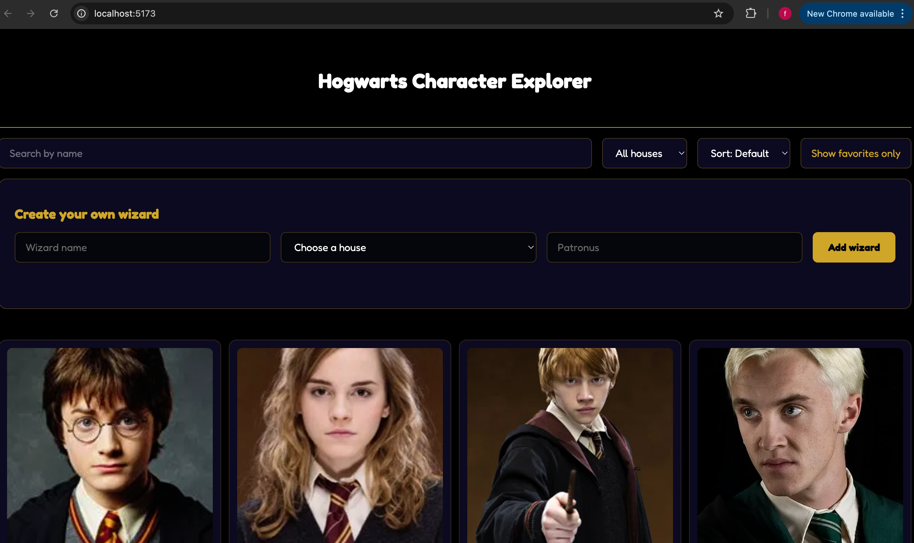
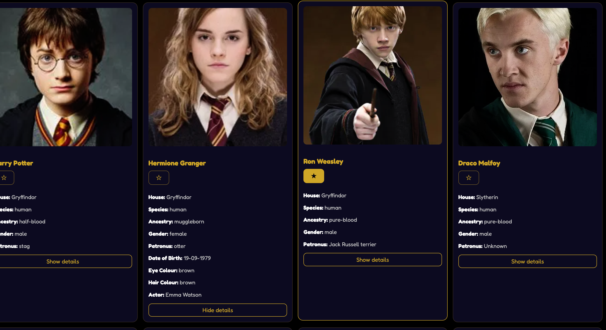
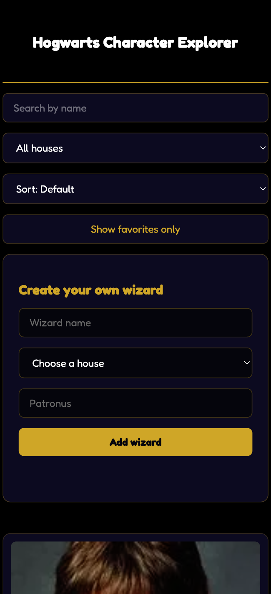
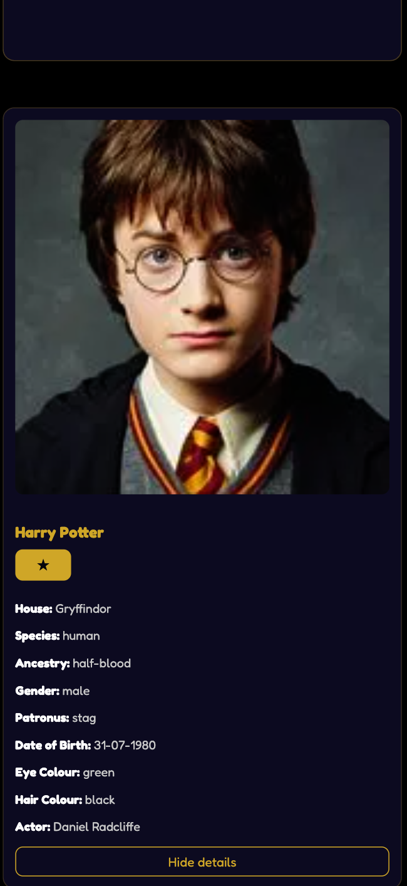

Projectbeschrijving:

Hogwarts Character Exploreris een enkelvoudige pagina applicatie waarmee je de characters van de Harry potter films mee kunt opzoeken, filteren,sorteren , opslaan van je favoriete characters en je eigen tovenaar kunt maken. Deze applicatie is gemaakt in kader van het vak Web Advanced.

Functionaliteiten:

- Harry Potter filmpersonages bekijken in een responsieve card-grid
- Zoeken op naam met live filtering
- Filteren op Hogwarts-huis (Gryffindor, Slytherin, Hufflepuff, Ravenclaw)
- Alfabetisch sorteren (A-Z en Z-A)
- Extra details per personage tonen of verbergen met een knop
- Personages opslaan als favoriet (bewaard met localStorage)
- Filteren om enkel favorieten te tonen
- Een eigen tovenaar aanmaken via een formulier met validatie
- Lazy loading van afbeeldingen voor betere prestaties
- Volledig responsief ontwerp voor mobiel, tablet en desktop

Gebruikte API's: 
HP-API — https://hp-api.onrender.com/
Gebruikt endpoint: `https://hp-api.onrender.com/api/characters`

DOM-manipulatie
- Elementen selecteren: `document.querySelector` — regel 7
- Elementen manipuleren: `card.innerHTML` — regel 108
- Gebeurtenislisteners: `addEventListener` — regel 46

Modern JavaScript
- Constanten: `const API_URL` — regel 1
- Sjabloonliteralen: kaartsjabloon — regel 108
- Array-iteratie: `characters.forEach` — regel 187
- Array-methoden: `.filter()` (regel 31), `.sort()` (regel 39), `.push()` (regel 94), `.includes()` (regel 139)
- Pijlfuncties: door de hele code, bijv. regel 39
- Ternaire operator: regel 34
- Callback-functies: callback in addEventListener — regel 49
- Promises: `fetch()` — regel 200
- Async & Await: `getCharacters` (regel 198), await op regels 200 en 206
- Observer API: `IntersectionObserver` — regel 162

Gegevens & API:
- Fetch: `await fetch(API_URL)` — regel 200
- JSON-manipulatie: `response.json()` (regel 206), `JSON.parse`/`JSON.stringify` (regels 10, 13)

Opslag & Validatie:
- LocalStorage: `loadFavorites` (regel 8) en `saveFavorites` (regel 12)
- Formuliervalidatie: `wizardForm` submit-handler met preventDefault — regel 56

Stijl & Lay-out:
- HTML-lay-out met CSS Grid en Flexbox — `src/css/style.css`
- Basis CSS-opmaak — `src/css/style.css`
- Gebruiksvriendelijke elementen (knoppen, ster-toggle, foutmeldingen) — door de hele code

Tooling & structuur:
- Vite-projectopzet — `package.json`
- Productiebouw (geminificeerd) — map `dist/` via `npm run build`
- Mappenstructuur — aparte HTML, `src/css/`, `src/js/`

Installatiehandleiding:

1.kopieer de repository:https://github.com/FxH24/Harry-potter-project.git 

2.ga naar de project folder: cd Harry-potter-project

3. installeer de dependencies: npm install

4.start de developer server: npm run dev

5.open de URL die tevoorschijn komt in de terminal: http://localhost:5173/

Screenshots:

Gebruikte bronnen:
1.https://claude.ai/share/fd7a07e7-5710-4145-b795-3ffa47586bab

2.https://youtube.com/shorts/HgZJZsGOXbA?si=NzqqhTUj0Cu-lmz6